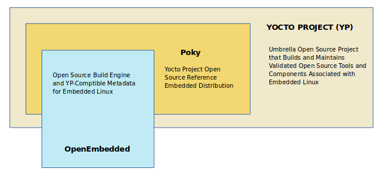
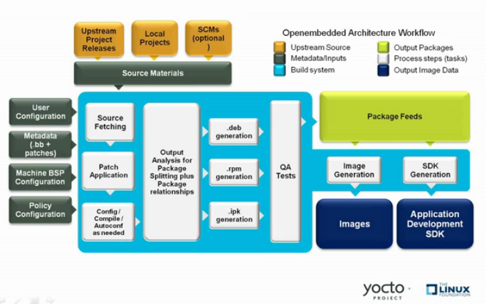

# Part 1: Introduction
## 1. What is the Yocto Project
Open source project that helps create custom Linux-based systems that are designed for embedded products. 



## 2. Yocto project layer model
Different layers logically separate information in the build, e.g: BSP, GUI, distro configuration, middleware, or application layers. Facilitating ability to customize and reuse.  
> Note: 
* Use Board Support Package (BSP) when possible
* Use [Yocto Project Compatible Layers](https://www.yoctoproject.org/software-overview/layers/) or [OpenEmbedded Layer Index](https://layers.openembedded.org/)

The [Source Directory](https://docs.yoctoproject.org/ref-manual/terms.html#term-Source-Directory) contains both general layers and BSP layers right out of the box. You can easily identify layers that ship with a Yocto Project release in the Source Directory by their names. Layers typically have names that begin with the string meta-.

Tree view of poky repository:
```sh
Mode	Name	Size	
-rw-r--r--	.b4-config	220	logstatsplain
-rw-r--r--	.gitignore	769	logstatsplain
-rw-r--r--	.templateconf	83	logstatsplain
-rw-r--r--	LICENSE	834	logstatsplain
-rw-r--r--	LICENSE.GPL-2.0-only	15394	logstatsplain
-rw-r--r--	LICENSE.MIT	1286	logstatsplain
-rw-r--r--	MAINTAINERS.md	2200	logstatsplain
-rw-r--r--	MEMORIAM	244	logstatsplain
-rw-r--r--	README.OE-Core.md	992	logstatsplain
l---------	README.hardware.md -> meta-yocto-bsp/README.hardware.md	33	logstatsplain
l---------	README.md -> README.poky.md	14	logstatsplain
l---------	README.poky.md -> meta-poky/README.poky.md	24	logstatsplain
-rw-r--r--	README.qemu.md	521	logstatsplain
-rw-r--r--	SECURITY.md	1065	logstatsplain
d---------	bitbake	523	logstatsplain
d---------	contrib	70	logstatsplain
d---------	documentation	1383	logstatsplain
d---------	meta-poky	176	logstatsplain
d---------	meta-selftest	316	logstatsplain
d---------	meta-skeleton	240	logstatsplain
d---------	meta-yocto-bsp	259	logstatsplain
d---------	meta	815	logstatsplain
-rwxr-xr-x	oe-init-build-env	1488	logstatsplain
d---------	scripts	4231	logstatsplain
```

## 3. Development methods
### 3.1 Build Host
* Native Linux Host: [Setting up a native linux host](https://docs.yoctoproject.org/dev-manual/start.html#setting-up-a-native-linux-host)
* CROss PlatformS (CROPS): 
Use [CROPS](https://github.com/crops/poky-container/) which leverages Docker Containers to set up a Build Host## 5. Reference embjedded distribution (Poky)
* Windows Subsystem For Linux (WSL2)
* Toaster: Web interface to the Yocto Project's OpenEmbedded Build System

### 4. Refernece Embedded Distribution (Poky)
Poky is a base specification of the functionality needed for a typical embedded system. 

Poky = BitBake + OpenEmbedded-Core, *meta-poky*, *meta-yocto-bsp* + documentation


Components: 
* BitBake: task executor and scheduler that's the heart of the OpenEmbedded build system 
* *meta-poky*: Poky-specific metadata
* *meta-yocto-bsp*: Yocto Project specific Board Support Packages (BSPs)
* OpenEmbedded-Core (OE-Core): metadata, includes shared configurations, global variable definitions, shared classes, packaging and recipes. 
* Documentation: used to make the set of user manuals 

## 5. OpenEmbedded build system workflow
Workflow to accomplish image and SDK generation:

* 1. Developers specify architecture, policies, patches and configuration details.
* 2. Fetches and downloads source code.
* 3. Build system extracts sources and applied patches, configure and compile the software.
* 4. Build system installs the software into a temporary staging area where the package format (deb, rpm, ipk) is used to roll up the software.
* 5. QA and sanity checks.
* 6. Build system generates a binary package feed that is used to create the final root file image.
* 7. Build system generates the file system image and customized Extensible SDK (eSDK)